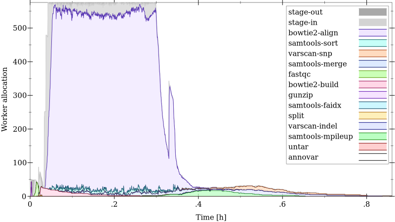
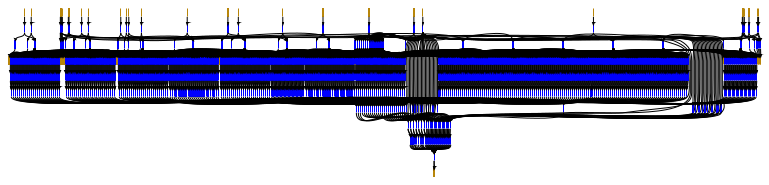

Home
====

.. image:: img/cuneiform_title.jpg
  :width: 800
  :alt: Cuneiform: data analysis open and general

.. toctree::
  :hidden:

  about
  news/index
  download
  publication
  videos
  tutorial/index
  guide/index
  explain/index
  reference/index

Cuneiform is a language for large-scale data analysis. It is open because it easily integrates foreign tools and libraries, e.g., Python libraries or command line tools. It is general because it has the expressive power of a functional programming language. Cuneiform uses distributed Erlang to scalably run in cluster and cloud environments.

.. code::

  def greet( person : Str ) -> <out : Str>
  in Bash *{
    out="Hello $person"
  }*

  ( greet( person = "world" )| out );

Parallelize and Distribute
--------------------------

Cuneiform is built on distributed Erlang which allows setting up large clusters of Cuneiform workers on top of a Posix-conforming distributed file system with minimal effort. Since Cuneiform is a functional language, it can evaluate sub-expressions independently in a distributed setting assuming foreign functions are deterministic. This way, potential parallelism can be inferred without additional annotation from the user.

  Worker allocation over time for a variant calling workflow with 12300 foreign function applications.

  Data dependency graph for the same variant calling workflow.

Integrate Your Software
-----------------------

The flexible foreign function interface lets you integrate tools and libraries from many different sources. This allows you to drive a heterogeneous software collection through a uniform interface. Currently, the following foreign languages are supported:

====== ========== ========== ======
Awk    Gnuplot    GNU Octave Racket
Bash   Java       Perl
Elixir Javascript Python
Erlang MATLAB     R
====== ========== ========== ======

Functional Programming
----------------------

Cuneiform is a functional programming language, i.e., functions are values. Furthermore, Cuneiform excites a declarative programming style by allowing only immutable variables and data. With general recursion unbounded iteration is available. Cuneiform provides lists and records as compound data types. Lists are accessed only via mapping and folding (excluding the unsafe head and tail accessors). Records can be accessed either through projection or through pattern matching.

Static Types
------------

A static type system excludes the possibility of runtime errors at the Cuneiform-native level. In the absence of recursion, also termination is guaranteed. While software can still fail (or diverge) at the foreign language level, Cuneiform helps to subdivide a large program into a set of independent foreign code islands which are easier to maintain.

Theoretic Foundation
--------------------

Cuneiform is designed from both, a programming language and a distributed systems perspective. Its language semantics are defined in terms of reduction semantics while communication, distributed coordination, and fault tolerance are specified using Petri nets.

Resources
---------

* Source code on `GitHub <https://github.com/joergen7/cuneiform/>`_