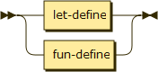
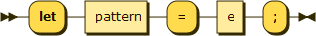
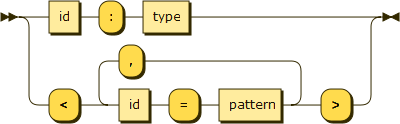
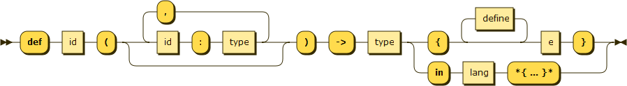
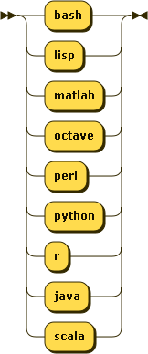

.. _syntax-define:

Definition
==========

**define:**

Uses:

- :ref:`syntax-let-define`
- :ref:`syntax-fun-define`

Appears in:

- :ref:`syntax-statement`

.. _syntax-let-define:

Let Definition
--------------

**let-define:**

Uses:

- :ref:`syntax-pattern`
- :ref:`syntax-e`

Appears in:

- :ref:`syntax-define`

.. _syntax-pattern:

Pattern
-------

**pattern:**

Uses:

- :ref:`syntax-type`

Appears in:

- :ref:`syntax-let-define`

.. _syntax-fun-define:

Function Definition
-------------------

**fun-define:**

Uses:

- :ref:`syntax-type`
- :ref:`syntax-lang`
- :ref:`syntax-define`
- :ref:`syntax-e`

Appears in:

- :ref:`syntax-define`

.. _syntax-lang:

Language
--------

**lang:**

Appears in:

- :ref:`syntax-fun-define`