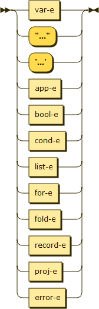
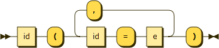
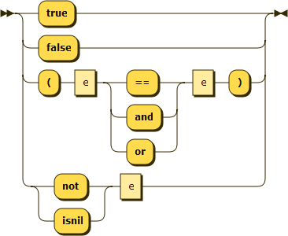
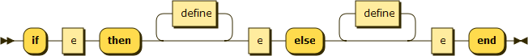
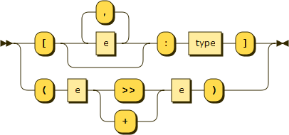
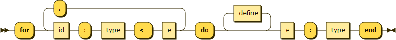
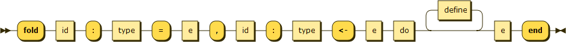

.. _syntax-e:

Expression
==========

**e:**

Uses:

- :ref:`syntax-var-e`
- :ref:`syntax-app-e`
- :ref:`syntax-str-e`
- :ref:`syntax-file-e`
- :ref:`syntax-bool-e`
- :ref:`syntax-cond-e`
- :ref:`syntax-list-e`
- :ref:`syntax-for-e`
- :ref:`syntax-fold-e`
- :ref:`syntax-record-e`
- :ref:`syntax-proj-e`
- :ref:`syntax-error-e`

Appears in:

- :ref:`syntax-statement`
- :ref:`syntax-let-define`
- :ref:`syntax-fun-define`

.. _syntax-var-e:

Variable
--------

**var-e:**

Appears in:

- :ref:`syntax-e`

.. _syntax-app-e:

Function Application
--------------------

**app-e:**

Uses:

- :ref:`syntax-e`

Appears in:

- :ref:`syntax-e`

.. _syntax-str-e:

String
------

**str-e:**

Appears in:

- :ref:`syntax-e`

.. _syntax-file-e:

File
----

**file-e:**

Appears in:

- :ref:`syntax-e`

.. _syntax-bool-e:

Boolean
-------

**bool-e:**

Uses:

- :ref:`syntax-e`

Appears in:

- :ref:`syntax-e`

.. _syntax-cond-e:

Conditional
-----------

**cond-e:**

Uses:

- :ref:`syntax-define`
- :ref:`syntax-e`

Appears in:

- :ref:`syntax-e`

.. _syntax-list-e:

List
----

**list-e:**

Uses:

- :ref:`syntax-e`
- :ref:`syntax-type`

Appears in:

- :ref:`syntax-e`

.. _syntax-for-e:

For Iteration
-------------

**for-e:**

Uses:

- :ref:`syntax-define`
- :ref:`syntax-e`
- :ref:`syntax-type`

Appears in:

- :ref:`syntax-e`

.. _syntax-fold-e:

Fold Iteration
--------------

**fold-e:**

Uses:

- :ref:`syntax-define`
- :ref:`syntax-e`
- :ref:`syntax-type`

Appears in:

- :ref:`syntax-e`

.. _syntax-record-e:

Record
------

**record-e:**

.. image:: img/record-e.png

Uses:

- :ref:`syntax-e`

Appears in:

- :ref:`syntax-e`

.. _syntax-proj-e:

Record Projection
-----------------

**proj-e:**

Uses:

- :ref:`syntax-e`

Appears in:

- :ref:`syntax-e`

.. _syntax-error-e:

Error
-----

**error-e:**

Uses:

- :ref:`syntax-type`

Appears in:

- :ref:`syntax-e`
