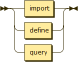

.. _syntax-statement:

Statement
=========

Cuneiform scripts are made up of statements. There are three kinds of statements: (i) an import-statement references definitions from a different Cuneiform source file, (ii) a define-statement introduces a new variable binding (potentially shadowing a pre-existing variable binding), and (iii) a query-statement of the form of an expression and a ``;`` triggers the evaluation of that expression.

**statement:**

Uses:

- :ref:`syntax-import`
- :ref:`syntax-define`
- :ref:`syntax-query`

Appears in:

- :ref:`syntax-script`

.. _syntax-import:

Import
------

An import-statement allows to reference definitions from a different Cuneiform source file.

**import:**

.. image:: img/import.png

Appears in:

- :ref:`syntax-statement`

.. _syntax-query:

Query
-----

**query:**

.. image:: img/query.png

Uses:

- :ref:`syntax-e`

Appears in:

- :ref:`syntax-statement`
