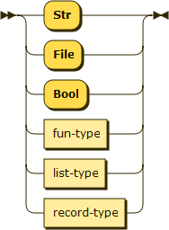
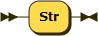
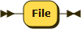
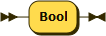
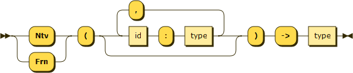
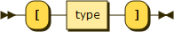
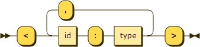

.. _syntax-type:

Type
====

**type:**

Uses:

- :ref:`syntax-str-type`
- :ref:`syntax-file-type`
- :ref:`syntax-bool-type`
- :ref:`syntax-fun-type`
- :ref:`syntax-list-type`
- :ref:`syntax-record-type`

Appears in:

- :ref:`syntax-fun-define`
- :ref:`syntax-pattern`
- :ref:`syntax-for-e`
- :ref:`syntax-fold-e`
- :ref:`syntax-error-e`
- :ref:`syntax-fun-type`
- :ref:`syntax-list-type`
- :ref:`syntax-record-type`

.. _syntax-str-type:

String Type
-----------

**str-type:**

Appears in:

- :ref:`syntax-type`

.. _syntax-file-type:

File Type
---------

**file-type:**

Appears in:

- :ref:`syntax-type`

.. _syntax-bool-type:

Boolean Type
------------

**bool-type:**

Appears in:

- :ref:`syntax-type`

.. _syntax-fun-type:

Function Type
-------------

**fun-type:**

Uses:

- :ref:`syntax-type`

Appears in:

- :ref:`syntax-type`

.. _syntax-list-type:

List Type
---------

**list-type:**

Uses:

- :ref:`syntax-type`

Appears in:

- :ref:`syntax-type`

.. _syntax-record-type:

Record Type
-----------

**record-type:**

Uses:

- :ref:`syntax-type`

Appears in:

- :ref:`syntax-type`
