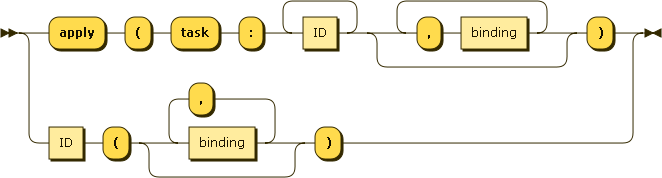

.. _syntax_app:

Application (app)
=================

An Application (app) applies the task identified by its ID binding the tasks arguments to the given values.

A :ref:`syntax_expr` can be an Application.

**app:**

::

    app ::= ID '(' ( binding ( ',' binding )* )? ')'
    
References:

- :ref:`syntax_binding`

ID:
   An ID is a regular string beginning with a letter and containing letters,
   numbers, or the symbols -, _, or . and not being a keyword.

Examples
--------

An Application of the task ``sim`` consuming no input parameters::
	
    sim()
    
An Application of the task ``greet`` binding its only parameter ``person``
to a Compound Expression consisting of three string literals::
	
    greet( person: "Jenny" "Peter" "John" )
        
An Application of the tasks ``bowtie2-align`` and ``bwa-align`` binding
their two input parameters ``idx`` and ``fastq``::
	
    apply( task:  bowtie2-align bwa-align,
           idx:   bowtie2-idx bwa-idx,
           fastq: fastq )
