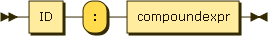

.. _syntax_binding:

Parameter Binding (binding)
===========================

A Parameter Binding (binding) is an ID on the left-hand side of a colon and a
:ref:`syntax_compoundexpr` on the right-hand side.

Parameter bindings can be part of an :ref:`syntax_app`.

**binding:**

::

    binding ::= ID ':' compoundexpr
    
References:

- :ref:`syntax_compoundexpr`

ID:
   An ID is a regular string beginning with a letter and containing letters,
   numbers, or the symbols -, _, or . and not being a keyword.

