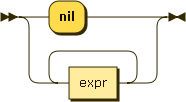

.. _syntax_compoundexpr:

Compound Expression (compoundexpr)
==================================

A Compound Expression (compoundexpr) is either the keyword *nil* or a series of
one or more elements of the form of a :ref:`syntax_expr`.

A Compound Expression can be part of a query :ref:`syntax_stat` or the
right-hand side of an :ref:`syntax_assign`. Furthermore it can be the condition,
then-block, or else block of a conditional :ref:`syntax_expr`, or the right-hand
side of a parameter binding in an application :ref:`syntax_expr`.

**compoundexpr:**

::

    compoundexpr ::= 'nil'
                   | expr+
        
References:

- :ref:`syntax_expr`

Examples
--------

The empty list::
	
    nil
    
A list with a single element *5*::
	
    5
    
A list with a single element *"Hello world"*::
	
    "Hello world"
    
A list comprising the strings *"Jorgen"*, *"Marc"*, and *"Ulf"*::
	
    "Jorgen" "Marc" "Ulf"
    
A list concatenating the output of the functions *sim1* and *sim2*::
	
    sim1() sim2()
    
