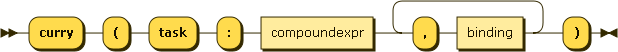

.. _syntax_cur:

Curry Expression (cur)
======================

A Curry Expression (cur) simplifies a Task Definition by binding one or more
of its parameters. It starts with the keyword ``curry`` and binds the special parameter
``task`` to one or more tasks identified by their IDs. Then follow parameter
bindings.

A :ref:`syntax_expr` can be a Curry Expression.

**app:**

::

    cur ::= 'curry' '(' 'task' ':' ID+ ( ',' binding )+ ')'
    
References:

- :ref:`syntax_binding`

ID:
   An ID is a regular string beginning with a letter and containing letters,
   numbers, or the symbols -, _, +, \*, or / and not being a keyword.

