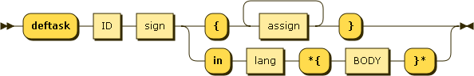

.. _syntax_defun:

Task Definition (defun)
=======================

A Task Definition (defun) defines a task with an ID and a
:ref:`syntax_sign`. A task can be native, in which case it has a native
body consisting of one or more elements of the form of an :ref:`syntax_assign`.
Furthermore, a task can be foreign, in which case it has a :ref:`syntax_lang`
and a foreign BODY enclosed in mickey mouse-eared curly braces.

A :ref:`syntax_stat` can be a Task Definition.

**defun:**

::

    defun ::= 'deftask' ID sign( '{' assign+ '}' | 'in' lang '*{' BODY '}*' )
    
References:

- :ref:`syntax_sign`
- :ref:`syntax_lang`

ID:
   An ID is a regular string beginning with a letter and containing letters,
   numbers, or the symbols -, _, +, \*, or / and not being a keyword.
   
BODY:
   The BODY is a regular string not containing the symbols } and \* in a row.	

Examples
--------

The *identity* task defined natively::
	
    deftask identity( out : inp ) {
      out = inp;
    }
    
A *greet* task with a foreign body in the language Bash::
	
    deftask greet( out : person )in bash *{
      out="Hello $person"
    }*
    
A task in R adding pairs of numbers::
	
    deftask addpair( c : a b )in r *{
      c = a+b
    }*
    
A task definition in Bash extracting a tar archive::
	
    deftask untar( <out( File )> : tar( File ) )in bash *{
      tar xf $tar
      out=`tar tf $tar`
    }*

A task in Bash gunzipping a compressed file::
	
    deftask gunzip( out( File ) : gz( File ) )in bash *{
      gzip -c -d $gz > $out
    }*

A task in Bash concatenating a list of files::
	
    deftask cat( out( File ) : <file( File )> )in bash *{
      cat ${file[@]} > $out
    }*
