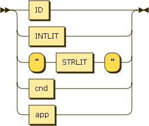

.. _syntax_expr:

Singular Expression (expr)
==========================

A Singular Expression is either an ID, acting as a placeholder for expression,
an INTLIT, a STRLIT enclosed in quotes, a :ref:`syntax_cond`, an
:ref:`syntax_app`, or a :ref:`syntax_cur`.

An Expression can be part of a :ref:`syntax_compoundexpr`.

**expr:**

::

    expr ::= ID
           | INTLIT
           | '"' STRLIT '"'
           | cond
           | app
           | cur
    
References:

- :ref:`syntax_cond`
- :ref:`syntax_app`
- :ref:`syntax_cur`

ID:
   An ID is a regular string beginning with a letter and containing letters,
   numbers, or the symbols -, _, +, \*, or / and not being a keyword.
   
INTLIT:
   An INTLIT is an integer literal either being a single-digit number from 0 to
   9 or a multiple-digit number starting with a digit from 1 to 9 and containing
   digits from 0 to 9. An INTLIT can be negative with a leading -.
   
STRLIT:
   A STRLIT is a string literal containing any symbol except a ".

