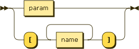

.. _syntax_inparam:

Input Parameter (inparam)
=========================

An Input Parameter (inparam) is either a :ref:`syntax_param` or a list of
correlated elements of the form of a :ref:`syntax_name`.

An Input Parameter can appear in the input parameter list of a
:ref:`syntax_sign`.

**inparam:**

::

    inparam ::= param
              | '[' name+ ']'
    
References:

- :ref:`syntax_name`
- :ref:`syntax_param`

ID:
   An ID is a regular string beginning with a letter and containing letters,
   numbers, or the symbols -, _, or . and not being a keyword.

