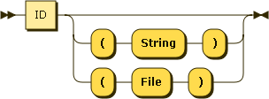

.. _syntax_name:

Typed Name (name)
=================

A Typed Name (name) is an ID with an optional type specification. A missing type
specification defaults to the type *String*.

A Statement can be part of a :ref:`syntax_param`, an :ref:`syntax_inparam`, or
the task correlation list of a :ref:`syntax_sign`.

**name:**

::

    name ::= ID( '(' 'String' ')' | '(' 'File' ')' )?
    
ID:
   An ID is a regular string beginning with a letter and containing letters,
   numbers, or the symbols -, _, +, \*, or / and not being a keyword.  

