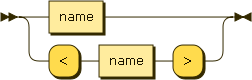

.. _syntax_param:

Generic Parameter (param)
=========================

A Generic Parameter (param) is a :ref:`syntax_name` either with or without
angle brackets. If a Generic Parameter appears with angle brackets, the
parameter is not decomposed instead it is treated as a list. 

A Generic Parameter can appear in a :ref:`syntax_sign` either as an output
parameter or as an :ref:`syntax_inparam`.

**param:**

::

    param ::= name
            | '<' name '>'
    
References:

- :ref:`syntax_name`

