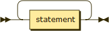

.. _syntax_script:

Script (script)
===============

The Script (script) is the top-level entry point for a Cuneiform program. It is
a series of declarations in the form of a :ref:`syntax_stat`.

**script:**

::

    script ::= stat+
    
References:

- :ref:`syntax_stat`

