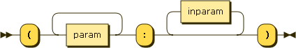

.. _syntax_sign:

Task Signature (sign)
=====================

A Signature (sign) comprises a list of output elements of the form of a
:ref:`syntax_param` and a list of elements of the form of an :ref:`syntax_inparam`.

A Signature is a specification of all output, and input parameters in a
:ref:`syntax_defun`.

**sign:**

::

    sign ::= '(' param+ ':' inparam* ')'

    
References:

- :ref:`syntax_param`
- :ref:`syntax_name`
- :ref:`syntax_inparam`

Examples
--------

A signature of a task with no input parameters and just one output parameter
*out*::
	
    ( out : )
    
A signature with one output parameter *out* and one input parameter *inp*::
	
    ( out : inp )
    
A signature creating the cross-product of two input parameters *a* and *b*
applying the task to each combination and returning an output *out*::
	
    ( out : a b )
    
A signature creating the dot-product of two input parameters *a* and *b*
applying the task to each combination and returning an output *out*::
	
    ( out : [a b] )
    
A signature consuming the list *x* as a whole and returning an output *out*::

    ( out : <x> )
    
A signature mapping over the input parameter *x* producing a list *out* in each
instance::
	
    ( <out> : x )
    
