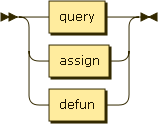

.. _syntax_stat:

Statement (stat)
================

A Statement (stat) can be either :ref:`syntax_query`, an :ref:`syntax_assign`, or a
:ref:`syntax_defun`.

A Statement can be part of a :ref:`syntax_script`.

**stat:**

::

    stat ::= query
           | assign
           | defun
    
References:

- :ref:`syntax_query`
- :ref:`syntax_assign`
- :ref:`syntax_defun`
